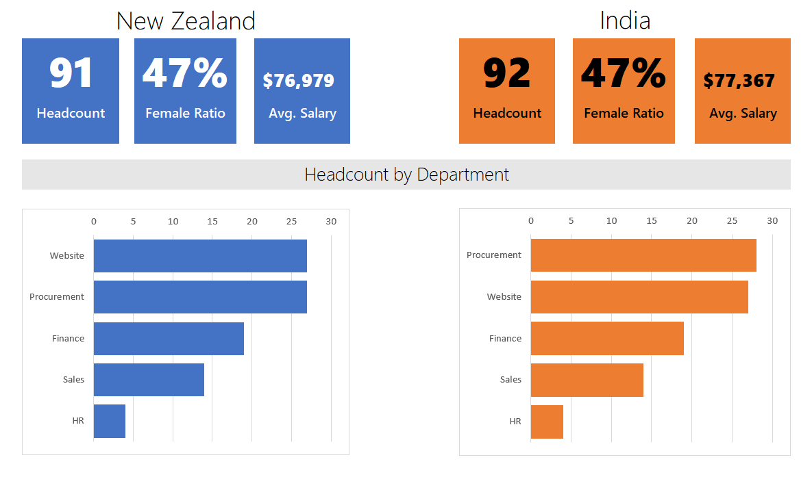

# Excel Projects

## PGA Tour Player Dashboard

Dashboard created with data collected from [kaggle.com](https://www.kaggle.com/datasets/jmpark746/pga-tour-data-2010-2018). View stats for each professional golfer and select two stats for comparison for years 2010-2018.

```
projects/pga/PGA Tour Dashboard.xlsx
```


 
## Staff Analysis

Worked through an Excel tutorial and created basic summary statistics from a fictional company with locations in India and New Zealand.

Cleaned data with Power Query, added drop down lists to filter data, created charts and a simple dashboard.

```
projects/staff-analysis/Clean, Analyize, and Present Data.xlsx
```

